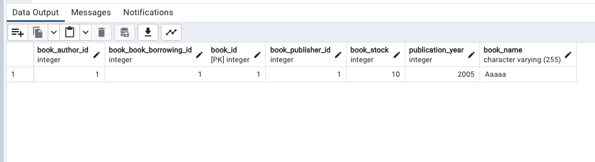
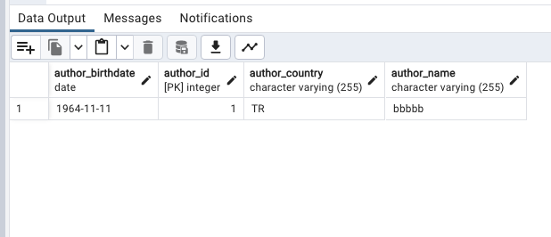
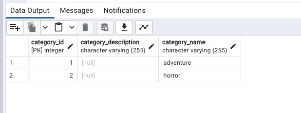
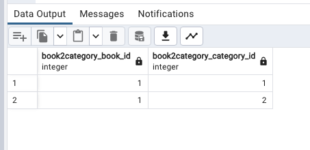
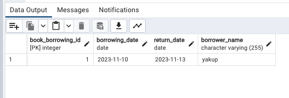
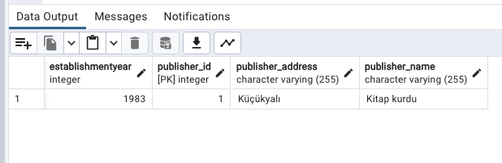

Project Description

Dependency defined with maven project.

Entity classes and the relationships between them were created.

Necessary annotations were made.

Necessary Fetch and Cascade annotations were made.

Data added according to relationships between entities.

Database tables screenshot

Book Table

Author Table

Category Table

Book2Category Table

Book Borrowing Table

Publisher Table
